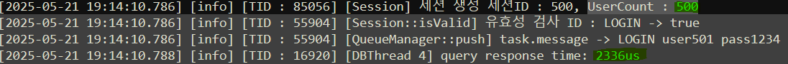

# 범용 서버 템플릿 제작 (C++ Asio 스레드풀 비동기 멀티스레딩)
- 개요
    - 토이프로젝트로 게임 서버 - 클라이언트 제작 도중 매번 서버 구축의 불편함을 느낌
    - 개인적으로 사용할 게임서버 템플릿 제작 욕구로 인해 토이프로젝트 프로그램을 기반으로 템플릿화 시도

# 목표


- 서버 아키텍쳐의 이해
- 비동기 네트워킹에 대한 깊은 이해
- 스레드풀 구조에 대한 이해와 구축 경험
- 대규모 트래픽을 염두하여 대응할 수 있는 서버 설계 및 구축
- 보안과 유지보수&가독성

# 목차
[작업&이슈목록](#작업--이슈-목록)

### 개발일지
#### 범용 템플릿화 시작 (250519~)
1. [범용성 확보 리팩토링 설계 & DB관련 기능 상세설계](#1회차--기존-프로그램---템플릿화-리팩토링--db-송수신-담당-클래스-설계)
2. [DB 연동 및 쿼리 성능테스트](#2회차--mysql-x-dev-환경-설정-및-db-연결)
3. [DB매니저 개선 및 서버 부하테스트](#3회차-db매니저-개선-및-서버-부하테스트)
4. [커스텀 캐싱시스템 구축](#4회차-캐싱-시스템-도입)
- [개발일기장](#회고록)

#### 기존 개발일지 (~250519)
1. [최초서버설계](#1회차--스레드-풀-기초구조-설계)
2. [네트워크설계](#2회차--asio가-제공하는-async_send-메서드-활용하여-메시지-송신-해보기)
3. [비동기송수신구현](#3회차--비동기-송수신-구현--로직네트워킹-스레드-분리)
4. [TLS적용](#4회차--패킷-보안-패치-open-ssl-활용)
5. [패킷 리디자인](#5회차--패킷-기능-리팩토링)
- [개발일기장](#분노의-개발일기장)


---
## 작업 / 이슈 목록
- TASK LIST
    - [X] [리팩토링기능기획](#1회차--기존-프로그램---템플릿화-리팩토링--db-송수신-담당-클래스-설계) [250514~]
    - [X] [Acceptor, 비동기네트워크 구현](#2회차--asio가-제공하는-async_send-메서드-활용하여-메시지-송신-해보기) [250515~16]
    - [X] [비동기송수신 스레드풀, 게임로직 스레드 풀](#3회차--비동기-송수신-구현--로직네트워킹-스레드-분리) [250517]
    - [X] [TLS보안패치](#4회차--패킷-보안-패치-open-ssl-활용) [250518]
    - [X] [DB 연동](#2회차--mysql-x-dev-환경-설정-및-db-연결) [250520]
    - [X] [INDEX 전, 후 성능 비교](#db-인덱스-추가로-성능-높혀보기) [250520]
    - [X] [DB작업용 세션풀&스레드풀 구현 및 서버 1차 부하테스트](#3회차-db매니저-개선-및-서버-부하테스트) [250521]
    - [X] [커스텀 캐싱 시스템 설계 및 구축](#4회차-캐싱-시스템-도입) [250523]
    - [ ] REDIS 연동
    - [ ] REDIS 도입 전 후 성능 비교
    - [ ] 레이턴시 테스트
    - [ ] 대규모 트래픽 테스트
    - [ ] 성능 개선 리팩토링
    - [ ] 성능 개선 후 결과 체크
    <br>
- ISSUE LIST

    - [ ] 250518 터미널 한글 깨짐 현상으로인해 디버깅 불편
    - [X] 250518 / pch.h 미리컴파일된 헤더 사용 & hpp 파일 사용시 헤더충돌 문제 
        - (250519 hpp/cpp 분할구현 및 헤더정리완료)
    - [X] 250518 / Session::push_WriteQueue 메서드 Lock 중첩 -> 데드락 발생 
        - (250519 post 활용 해결)
---
### 범용 템플릿화 시작

#### 1회차 , 기존 프로그램 -> 템플릿화 리팩토링 , DB 송수신 담당 클래스 설계
- 범용 템플릿화를 위해 제공되야할 기능 정리
> 보안이 강화된 TCP 커넥션 (TLS 적용)

> 비동기 송 수신을 위한 네트워크 담당 스레드 풀 적용 (스펙에 따라 스레드 수 조절가능) 
> 시스템 콜 기반의 핸들링 작업 위주의 처리 (커널 레벨 스레드)

> 게임 로직처리를 위한 스레드 풀 적용 (유저 레벨 스레드)
> 비동기 작업을위해 모니터 패턴 적용 , 큐매니저 클래스로 패킷, 로직 등을 커스터마이징 가능하게 끔 구현

> DB연동 및 쿼리 송 수신을 위한 데이터베이스매니저 클래스 설계
> 싱글톤 객체가 자신의 스레드풀을 멤버로 가지고있게끔 설계하여 
> DB를 사용하지않는 가벼운 프로그램에서 유휴 스레드를 만들지 않게끔 설계함.

> 성능 향상을 위한 캐싱 시스템 도입 
> 캐시 시스템에 대한 구축 경험X , 지식도 얕은 상황이라, 직접 캐싱시스템 구축해본 후
> 최대고민 -> 어떻게 설계해야 범용적으로 사용이 가능한 캐시매니저가 될까
> 레디스 사용하기로 결정.

캐시 설계전 틈새 지식저장
| 전략                        | 설명                                    | 특징                     |
| ------------------------- | ------------------------------------- | ---------------------- |
| **Lazy Load (지연 캐싱)**   | 처음 접근할 때 캐싱 (`Cache-Aside`)           | 단순하고 효율적. 그러나 첫 조회는 느림 |
| **Eager Load (사전 로딩)**  | 서버 시작 시 or 주기적으로 미리 캐싱                | 초기 렉 감수하고 전체 캐시 미리 세팅  |
| **Refresh / TTL 기반 갱신** | 일정 시간마다 갱신 (`time-to-live`, 백그라운드 갱신) | stale 데이터 방지, 최신화 유지   |


> 추후 FSM 등 게임 도메인지식을 더 공부한 뒤 기능을 추가해 나갈예정
> 이 템플릿을 기반으로 여러 온라인 게임을 만들어 보는게 목표

- 기존 게임로직 삭제 및 코드 정리, 주석


- DB 송수신 담당 클래스 설계
    - 환경설정 : vcpkg install mysql-connector-cpp(vcpkg) , 헤더 : mysqlx/xdevapi.h 
    - DBManager
        - 범용성을 확보하기위해 최대한 쿼리 송 수신만 담당하게 하고싶었다.
        - 여러가지 설계를 구상하던 도중 성능과 확장성을 잡기위해 세션풀 + 스레드풀 조합으로 결정
        - DBManager (싱글톤) , 멤버 : 세션풀 , 스레드풀 , 모니터패턴을 조합하여 설계하기로 결정
    - DB 서포트 유틸 클래스 & 메서드
        1. set_dbInfo(ip,port,userId,pwd) : json에 저장된 DBconStr 정보를 긁어와서 클래스에 넣어준다.
                                          : 파라미터를 레퍼런스로 사용하여 사용자는 DBConData 클래스만 넘겨주면 된다.
        2. DBConData { ip, port, userId, pwd } : DBconStr 정보 담는 객체
        3. DBTask { std::function<void(mysqlx::Session&)> func } : 함수 컨테이너, 범용성 확보를 위해 
                                                                 Task별 실행할 함수를 등록할 수 있게끔 설계함
        <br>
    - 2회차에 DBManager 구현 예정 (캐싱X) -> 3회차 캐싱 도입 후 성능 비교
            <br>
        - 테스트 케이스 
            - 동일 SELECT 쿼리 반복 요청    (캐시 적중률 높은 상황 성능)
            - 대량 랜덤 SELECT 요청         (캐시 적중률 매우 낮은 상황 성능)
            - INSERT/UPDATE 중심 테스트     (캐싱 불가영역의 I/O 처리 성능 측정)
        - 테스트 포인트
            - 평균 응답 시간 (ms)
            - 초당 처리 쿼리수 (QPS)
            - 세션 풀/스레드 풀 활용률
            - CS 빈도                    

---

#### 2회차 , MySQL X Dev 환경 설정 및 DB 연결
- DBMS : MySQL / xDevAPI
- docker.desktop [mysql 서버 구동]
```
컨테이너 생성시 옵션설정
docker run -d \
  --name my-mysql \
  -e MYSQL_ROOT_PASSWORD=root \
  -p 3306:3306 -p 33060:33060 \
  mysql:8.0 \
  --mysqlx=ON \
  --mysqlx_port=33060 \
  --mysqlx_bind_address=0.0.0.0

터미널 환경에서 DBMS 사용
mysqlsh 설치

mysqlsh --uri root@127.0.0.1:33060
\sql  : SQL 모드로 전환
```
- 테스트용 DB 생성
    
    

- 테이블 생성 및 테스트 데이터 삽입

    

- DB 연동 테스트
    - 가상의 (테스트용) 로그인 시스템 구현
    - 클라 -> LOGIN ID PWD -> 서버 파싱 후 DB 쿼리 송수신
    - 연동 테스트 완료 후 응답시간 테스트를 위한 50만개의 더미데이터 생성

    

##### DB 인덱스 추가로 성능 높혀보기
- 응답시간 측정 방식 : chrono 헤더를 사용하여 쿼리 실행 전 시간 , 실행 후 시간을 구한 뒤
    - 실행 후 시간 - 실행 전 시간으로 총 실행 시간을 측정하였음.

    - 인덱스 없을 때의 응답시간 : 평균 90000μs 초반을 보임, 단위 :(μs)

        

    - 인덱스 추가 (테스트를 위한 로그인 기능, username , pwd 를 묶어서 인덱스생성)

        

    
    - 인덱스 추가 후 응답시간 : 평균 2300~2600μs 사이의 시간을 보임, 약 **1/32 의 시간을 절감**
        - 성능이 32배 좋아졌다로 귀결 , 인덱스의 중요성을 체감
        - 하지만 인덱스 사용시 성능이 저하되는 경우도 있어 주의해서 사용해야한다.

        


#### 3회차, DB매니저 개선 및 서버 부하테스트
- DB매니저 세션풀 , 스레드풀 도입으로 대규모 요청상황 대비
    - 세션풀 , 스레드풀 도입시 고민했던 사항
    - 세션풀 안의 세션들은 DB와 연결을 유지하고있어야한다.
    - 스레드 개수 보다 세션의 개수가 같거나 더 많아야한다.
        - 왜냐하면 스레드가 유휴상태인것 보다, 세션 객체가 유휴상태인 것이 더 효율적이라 판단
        - 처음 설계는 세션 렌트 방식으로 구현을 생각했으나 세션-스레드 1:1 매핑방식을 사용하기로 최종결정했다.
        - 이유는 스레드의 가용성을 생각한다면 렌트방식이 맞으나, DB관련 작업만 진행하는 `전용스레드` 이기 때문에 굳이 렌트를 해야하나? 라는 생각이 컷다.
- 세션 - 스레드 풀 구현 후 서버 부하테스트
    - 테스트 진행방법
        - 테스트 클라이언트에서 5000개의 스레드를 만들어 서버에 연결시도를 한다.
        - 각 스레드는 1000us 마다 LOGIN 패킷을 보낸다.
        - LOGIN 요청은 DB 쿼리작업을 수행한다.
    - 결과
        - 유저수 500명 일 때 QPS : 2336us 초

        

        - 유저수 750명 QPS : 5596us 초

        

        - 유저수 1000명 QPS : 11104us 초

        

        - 1000명 이후~ QPS : 12000 ~ 15000us 초

        - 결론 , 500명 까지 수용했을 때, 최적의 성능을 보였다.
        - 5000명까지 수용하고 서버 돌리는 데 문제가 없었다.
        - 이유를 추론해본 결과 : 계속해서 같은 요청을 보냈기 때문에 5000명을 수용한 후에는 db 자체 캐싱이 되어 db 작업에 큰 부하가 걸리지 않았기 때문인 것 같다. 만약 실제 게임로직처럼 복잡한 기능이 많았다면 500명도 벅차지 않았을까 하는 생각을 해보았다.
        - 후기 , 생각보다 테스트 케이스와 방법을 구상하고, 실제로 구현하는데 어려움을 많이 겪었다. 모니터링을 어떻게 해야할지, 어떻게 부하를 주는 걸 자동화 할지 초기부터 막혔었고, 주변에 물어보거나 GPT를 통해 간신히 구현할 수 있었다. 처음 해보는 작업이라 멘탈이 많이 나갔기 때문이기도 한데 계속 고민하고 실제로 구현해보며 익숙해지다보면 전체적인 흐름을 익힐 수 있을거라 생각해본다.

#### 4회차, 캐싱 시스템 도입
- Redis 를 아직 한번도 사용해보지 않은 관계로, 캐싱 시스템을 근본적으로 이해하고 사용해보기 위해서 직접 캐싱시스템을 구축해보았다.

- 설계 과정
    - 방식 채택 : Lazy Invalidation + Soft TTL
        - 이유 : 
            1. Lazy Invalidation : 테스트용 기능이 LOGIN 체크 기능이었기 때문에, 미리 읽어놓을만한 범위 예측이 힘들었기에 채택하게 됨.
            2. Soft TTL : 실시간 데이터의 변화가 수시로 일어나는 작업이 아니기 때문 + 구현의 편리함으로 인해 채택하게 됨.
            3. Sliding TTL : 로그인 오류, 클라이언트 튕김 현상 등이 발생한 클라이언트의 경우 재발할 가능성이 높다고 판단, 안그래도 좋지않은 감정을 가지게 될텐데 조금이라도 더 빠르게 로그인을 할 수 있도록, 요청이 들어 올 때마다 갱신 시켜주기로 결정.


- 흐름
    - 기존 : DB Task가 들어옴 -> DB매니저에서 쿼리 요청 -> DB 쿼리 결과 수신 -> 결과데이터 사용 후 소멸
    - 개선 : 
        - 1. hit : DB Task Input -> 캐시 체크 -> hit -> 캐시데이터 사용 (TTL 갱신)
        - 2. miss : DB Task Input -> 체크 -> miss -> DB 매니저 -> 데이터 사용 후 캐시에 저장

- 테스트 결과

    https://github.com/user-attachments/assets/4051a489-ee14-4275-8ce5-f3bfc0618ead

- 10초마다 TTL이 만료된 캐시데이터를 삭제해주는 cleanup() 메서드 실행
- 캐시 miss 시 DB -> Set() 메서드
- 캐시 hit 시 DB로 넘어가지 않고 바로 데이터를 가져오는 모습
- 캐시 종료시 바로 스레드가 종료되어 join 될 수 있도록, 모니터패턴을 활용해서 종료요청시 바로 notify 로 스레드를 깨워주는 방식을 채택

- 후기
    - 캐싱, 그저 캐싱 전용 클래스하나 만들어서 대충 자주쓰는거 담아놓는 시스템 으로 쉽게 생각하고있었다.
    - 실제 구현을 해보며, 무수한 케이스의 상황에 맞춰 대응되는 방법을 채택해야하고, 프로그램 내에 위치하게 할 것인지, 별도의 프로세스로 존재하게 할 것인지, 데이터는 언제 갱신할 것이며, 자주 사용되는 데이터를 어떻게 판단할 것인지 ... 다루기 정말 까다롭다고 느껴졌다. 하지만 한번 직접 구현해보면서 조금은 캐싱 시스템의 동작의 근본을 알게 된 것 같다. 이 후 Redis를 사용해보며 경험을 더 축적하면 적재적소에 캐싱을 효율적으로 사용할 수 있는 사고를 할 수 있을것 같다.

#### 회고록

- `250519 일기` TOPIC : 모니터패턴 + 스레드풀 구조와 IOCP 비동기 콜백 구조는 아무리 생각해도 서로 닮아있다.
    ```txt
    모니터패턴 + 스레드풀 에 대한 고찰
        Publisher 는 작업을 큐에 등록하고 다음 일을 한다. (매우 비동기 스러운 흐름이다.)
        그런데, 모니터 패턴 안 속을 들여다보면 동기 스러운 흐름이 존재한다.
        " Mutex Lock 경쟁 , 작업 큐에 작업이 들어올 때 까지 Wait (block) 한다. "
        CPU 관점으로 본다면 풀 안의 스레드 개수가 많아질 수록 유휴 스레드가 많아짐 -> 사용률이 낮아진다 로 귀결된다.
        메모리 관점으로 본다면 스레드 개수가 많아질 수록 메모리 공간을 크게 차지할 것이다. 
        리스크는 작업이 거희 없는 상황에도 공간만 차지하고 띵가띵가 노는 스레드들을 구경해야 할 것이다.
        그렇다면 이 패턴은 어떨 때 사용해야하는걸까?
        먼저, 이는 유저 레벨에서 구현되기 때문에, 컨택스트 스위칭 비용이 가볍고, 작업 순서등을 제어하는 등 유연하다.
        만약 작업이 꾸준하고, 예측 가능한 수준의 양의 작업 수 라면 충분히 최고의 효율을 자랑할 것이다.
        하지만, 업무량이 들쑥날쑥 예측이 불가능하다면 -> 적정 스레드 개수는 어떻게 맞춰야하는가?
        스레드 개수를 동적으로 관리 한다면? 예를 들어 작업큐가 꽉차서 (병목현상) 작업큐의 사이즈가 커져야 하는 상황이 된다면
        스레드 개수를 늘려주면 될것이고, 스레드가 wait 상태에서 일정 시간이상 할 일이 없다면 다시 원복시키면 되지 않을까?
        하지만 이런 점을 계속 개선시켜나간다고 해도 이 방법이 무적은 아니다!
        Inturrupt 와 같은 OS 레벨에서 감지하는 이벤트를 감지할 수 없다.

    IOCP 비동기 콜백 구조
        위의 패턴과 유사하게 동작하지만, 스레드가 대기하지 않는다, why? 비동기 작업등록 -> 콜백 함수 실행 으로 동작하기 때문이다. 
        그렇기 때문에 위 처럼 스레드가 wait 하면서 띵가띵가 노는걸 지켜볼 기회가 매우 적다.
        작업을 등록하고 다른 일을 하다가 Exception(광의의 Inturrupt)가 발생하면 즉시 이벤트 핸들링 후 등록된 콜백 함수를 실행한다.
        CPU 관점에서 본다면 쓰로틀이 아주 좋다고 볼수있다. (사용률이 아주 좋다.)
        메모리 관점에서도 적은 수의 스레드로 일당백을 할 수 있으니 공간을 많이 차지하지 않는다.
        하지만, 아무래도 유저레벨 과 커널레벨을 넘나드는 시스템콜, 즉 컨텍스트 스위칭이 더 빈번하게 일어나기 때문에
        오버헤드가 비교적 더 크다고 볼 수 있겠다.
        그래도 예측 불가능한 작업량이라도 적절한 수의 스레드로 커버할 수 있음은 큰 장점이고, 소켓 통신등의 네트워크 이벤트도
        감지가 가능하여 대체불가능한 방법이라고 볼 수 있겠다.
    ```

--- 

### 기존 개발일지 (~250519)
#### 1회차 , 스레드 풀 기초구조 설계 

- 비동기 Acceptor 기능 구현으로 클라이언트와 연결 테스트


- 초기 설계
    - 키워드 : 비동기 네트워킹 , 네트워크 | 로직 스레드 분리 , 스레드 풀 활용


---


---


---


---


---


---
#### 2회차 , Asio가 제공하는 async_send 메서드 활용하여 메시지 송신 해보기

- write 와 달리 send는 네트워크 혼잡도 , 버퍼 꽉참 등으로 인해 데이터가 잘려서 보내질 수 있어 유의해서 다루어야한다.
- send + queue 조합을 통해 안전성과, 자유도를 획득할 수 있다.
- 고성능 서버로 갈 수록 익혀놓아야 할 스킬인 것 같다.


---

#### 3회차 , 비동기 송.수신 구현 , 로직&네트워킹 스레드 분리

- 머리가 터질거같은 관계로 테스트용 클라이언트를 빠르게 구현(동기방식 & 쓰레드수신) 후 테스트결과


급조된 클라이언트인 관계로 입력받는곳이 어수선하다. 그래도 송,수신과 브로드캐스팅이 잘 작동하는 모습

- 수신은 쉬웠다.. 비동기 송신을 할 때 하나를 놓쳐서 몇시간 고생했다.
    - 동기 방식과는 다르게 비동기 송신은 콜백함수를 등록하게 되는데, 이 때 보낼 패킷을 사라지지않게 처리를 하지않고 지역변수 등으로 사용하게된다면 런타임 에러 지옥을 맛보게 된다. (why? 지역변수는 스택이 해제되면 소멸하는데, 없는녀석을 찾아서 송신하려고하니 ...)
    - 자료형을 그냥 string& 레퍼런스를 사용했어서 더 오류를 못잡았던것도 있다, 레퍼런스 생성한 곳 조차 함수 지역 스코프 안이라서 함수 종료시 사라져버리는 문제가 발생하는데, 그걸 인지하지 못한 채 이상한 부분 계속 건드리다가 해답을 찾음
    - 여러 해결방법이 있겠지만 나는 shared_ptr 을 사용하여 string 을 감싸주고 소멸하지않게 관리하여 해결하였다.


아래는 문제의 string이 생성되는 곳.. 기존 std::string& msg -> std::shared_ptr<std::string> shared_msg 로 변경,
레퍼런스 타입이라 괜찮겠지.. 했다가 호되게 당해버림


- 큐매니저 구현으로 로직처리와 네트워킹 업무를 분리해 주었다.
    - Asio가 제공하는 io_context 에는 비동기 네트워킹 작업만 등록
    - 서버가 처리해야할 다른 로직들은 큐매니저(싱글톤)에 등록 후 처리하게끔 구현했다.

```txt
-> 패킷 도착(인터럽트 발생) 
-> io_context 내 등록된 read 함수 실행 
-> 큐매니저의 Task Queue에 푸쉬
**모니터 패턴**
-> Task Queue에 데이터 생성됨 
-> 일거리를 찾기위해 wait중인 워커스레드에게 signal 전송 
-> 워커스레드 중 하나가 일어남
-> (아무도 lock을 안가지고있다면) 
-> lock 획득 후 Task Queue.pop() 
-> Task 처리&패킷가공 
-> Session 클래스에 있는 송신큐에 푸쉬
-> 준비된 메서드 실행으로 송신큐 체크하라고 신호 보냄 
-> write 함수 실행 [전송중에 또 실행되지 않기 위해 flag 변수 활용]
```

- 이론으로만 들었던 mutex , 모니터를 직접 구현해보며 **데드락**을 피하기위해 mutex lock을 들고 또 lock을 취득하려는 모습을 최대한 구현하지 않으려 노력했다.

- 패킷 도착 후 파싱 -> 로직 처리 구현 (일단은 테스트용 CHAT 기능만 구현)
    - 특징 : 채팅 메시지는 공백을 포함하여 한번에 수용하기위해 getline을 사용.
        


---

#### 4회차 , 패킷 보안 패치 (Open SSL 활용)

- 흐름
    - OpenSSL 의 공개키/개인키를 발급받는다. (crt / key)
    - asio::ssl::context 를 활용하여 tls 버전과 공개키, 개인키를 등록 하는등 환경설정을 해준다.
    - asio::ssl::stream\<tcp::socket> 객체를 만들어 기존의 소켓을 move, 감싸준다. (이 때 부터 소켓의 생명주기는 stream 내부로 들어가기에 사용자가 관리안해줘도 됨)
    - 그 다음 송신, 수신에서 기존 사용하던 socket 에서 stream 으로 바꿔주면 끝.
    - close() 대신 shutdown() 혹은 ssl_stream->async_shutdown() 호출이 필요하다.

- 짤막한 지식 추가
    - TCP 커넥션 -> **TLS 커넥션**
    - TLS 커넥션 (RSA)
        - 클라이언트 : TLS버전, 암호화 방식 목록, 랜덤 값 -> 서버
        - 서버 : 선택된 암호화 방식, 서버 공개키 인증서, 서버 랜덤 값 -> 클라
        - 클라이언트 : 공개키로 암호화한 pre-master key -> 서버
        - 서버 : 개인키로 복호화 후 대칭키 생성
        - 대칭키 기반 암호화통신

``` powershell
openssl req -x509 -nodes -newkey rsa:2048 -keyout server.key -out server.crt -days 365

# x509	X.509 인증서 생성
# nodes	개인키에 암호 안 걸게 함 (서버 자동 실행 시 유리)
# newkey rsa:2048	2048비트 RSA 키 생성
# keyout server.key	개인키 저장 파일
# out server.crt	인증서(공개키 포함) 저장 파일
# days 365	유효기간 1년

Country Name (2 letter code) [XX]: KR
State or Province Name (full name) []: Seoul
Organization Name (eg, company) []: owljunCompany
Common Name (e.g. server FQDN or YOUR name) []: localhost ## 실 서비스라면 도메인 주소입력
```

- 결과
    - 기능 문제없이 정상 작동하는 모습

        
    
    - TLS 적용 전 (와이어샤크)
        - 문제 : 패킷의 raw 데이터가 전부 노출, 중간에서 조작이 가능함

        
        
    CHAT OK 가 적나라하게 노출된 모습
    <br>
    - TLS 적용 후 (와이어샤크)
        - 해결 : TLS 적용 후 암호화된 데이터가 노출되어 조작 위협방지
        
        
        
        
    기존 TCP -> TLSv1.2 로 바뀐 모습
    <br>
    - 시행착오 : 첫 테스트 시 TLS 핸드쉐이크를 계속 실패하는 현상 발생
        - 해결 : 서버측 서버 클래스에서 소켓 생성 -> accept 후 -> TLS 핸드셰이크로 들어가는데,
        Accept 콜백 람다 안에 이 소켓을 참조캡쳐했던것이 문제, 지역변수인 소켓을 참조하여 소멸된 소켓을
        가지고 핸드셰이크를 진행 하게 된 것이 문제였음 shared_ptr + 복사캡쳐로 해결완료.

---

#### 5회차 , 패킷 기능 리팩토링

```txt
기존 유효패킷 아이디
{"CHAT","MOVE" }
.
"CHAT" -> "LOGIN" "CHAT" 두가지로 분리하여
{"CHAT","LOGIN","MOVE} 3가지 ID를 운용
```
기존 CHAT의 기능은 2가지로 분기하여 LOGIN 과 CHAT 기능 두가지를 담당했었는데, 
멀티플레이 지원을 위해 로그인시 서버에 접속중인 기존 플레이어와, 새로접속한 플레이어 동기화가 필요해졌다.
기존방식대로 진행해도 되었으나, 유지보수나 가독성 측면에서 코드가 길어지는 바람에, LOGIN 아이디를 추가하여 기능을 분리해주었다.

LOGIN 패킷 아이디 기능 흐름
- 새로운 플레이어 로그인 -> 서버측 플레이어목록에 플레이어 등록
- 클라에서 본인 아이디 인식을 위해 먼저 본인의 아이디를 전송,
- 이 때 순서를 보장하기위해 먼저 1:1 통신으로 본인의 아이디를 송신 큐에 등록
- 새 플레이어가 관리자 풀에 등록되었으니 현재 모든 플레이어 정보를 **브로드캐스팅**
- 클라이언트측 예외처리 -> 이미 존재하는 플레이어는 새로생성X , 새로운 플레이어만 새로생성

---

#### 분노의 개발일기장

- 비동기 수신과 송신 설계 
- 수신 (read, read_some, read_until ...)
    - 기본적으로 콜백함수(람다)를 다룰 때, **참조캡쳐** 를 사용하자. 특히 raw 버퍼 이녀석..
    - why? 비동기 수신 콜백은 보통 클라이언트와 연결되었을 때, 등록이 되는데 그 순간에 복사를 해버리면 데이터 수신 후에도 빈 값이 들어있을 확률 99.98% , 의문의 런타임 에러 발생으로 정신이 피폐해진다. 어떻게 아냐구요? 제가 그런행동을 해버렸거든요..

- 송신 (send, write ...)
    - 기본적으로 콜백함수(람다)를 다룰 때, **복사캡쳐** 를 사용하자. 특히 raw 버퍼 이자식;
    - why? 우리는 하나의 버퍼로 송신을 계속해야하잖아요? 보낼 준비가 되었을때 비동기로 송신콜백이 등록이 될텐데, 이 때 버퍼를 참조로 들고있다면 혼돈이 시작됩니다. (어떨때는 제대로 보내지고, 어떨때는 지옥의 런타임에러) 어떻게 알까요? 허허허
    - 보내기전 버퍼의 상태값을 복사해놔야 버퍼를 비워도 값이 유지되고 의도대로 전송이 되더랍니다!!

- 삽질하다가 알아낸 최고의 방법
    - **shared_ptr** 이라는 보물을 활용해야한다.
    - 정확하게는 shared_ptr + 복사 조합,, 이거 어떤 상황이던 대처가능한 사기템이다.
    - why? shared_ptr 자체는 객체의 주소값이지요, 그냥 복사캡쳐 해놓으면 콜백 실행시 원본에 접근해서 값 긁어오면 된다! ex) string msg = shared_ptr->buf; 그리고 **제일 중요한 생명주기 관리로 머리안아파도 된다**

- dynamic_buffer + read_until VS buffer + read_some ?
    - 전자 : 개발 매우 편리, 유연성 Good! But, 약간의 성능 저하 
    - 후자 : 개발 매우 불편, 하나하나 직접 신경써야함, But, 최고의 성능!
    - 결론 : 상황에 맞게 판단하여 사용하는게 똑똑한 설계가 아닐까..
