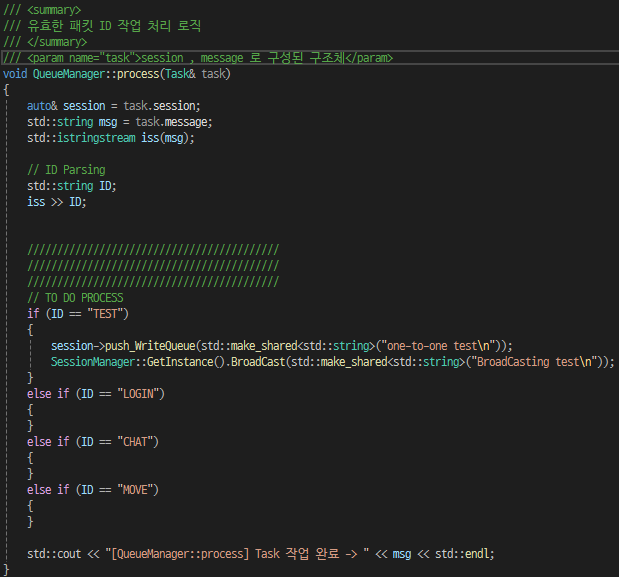

# 범용 서버 템플릿 제작 (C++ Asio 스레드풀 비동기 멀티스레딩)
- 개요
    - 토이프로젝트로 게임 서버 - 클라이언트 제작 도중 매번 서버 구축의 불편함을 느낌
    - 개인적으로 사용할 게임서버 템플릿 제작 욕구로 인해 토이프로젝트 프로그램을 기반으로 템플릿화 시도

# 목표
- 비동기 네트워킹에 대한 깊은 이해
- 스레드풀 구조에 대한 이해와 구축 경험
- 대규모 트래픽을 염두하여 대응할 수 있는 서버 설계 및 구축
- 보안과 유지보수&가독성

# 목차
[작업&이슈목록](#작업--이슈-목록)

### 개발일지
#### 범용 템플릿화 시작 (250519~)
1. [템플릿화 리팩토링](#1회차--기존-프로그램---템플릿화-리팩토링)
- [개발일기장](#회고록)

#### 기존 개발일지 (~250519)
1. [최초서버설계](#1회차--스레드-풀-기초구조-설계)
2. [네트워크설계](#2회차--asio가-제공하는-async_send-메서드-활용하여-메시지-송신-해보기)
3. [비동기송수신구현](#3회차--비동기-송수신-구현--로직네트워킹-스레드-분리)
4. [TSL적용](#4회차--패킷-보안-패치-open-ssl-활용)
5. [패킷 리디자인](#5회차--패킷-기능-리팩토링)
- [개발일기장](#분노의-개발일기장)


---
## 작업 / 이슈 목록
- TASK LIST
    - [ ] DB 연동
    - [ ] 성능 체크
    - [ ] INDEX , TRANSACTION 추가
    - [ ] INDEX 전, 후 성능 비교
    - [ ] REDIS 연동
    - [ ] REDIS 도입 전 후 성능 비교
    - [ ] 레이턴시 테스트
    - [ ] 대규모 트래픽 테스트
    - [ ] 성능 개선 리팩토링
    - [ ] 성능 개선 후 결과 체크
</br>
- ISSUE LIST

    - [X] 250518 / Session::push_WriteQueue 메서드 Lock 중첩 -> 데드락 발생 
        - (250519 post 활용 해결)
    - [X] 250518 / pch.h 미리컴파일된 헤더 사용 & hpp 파일 사용시 헤더충돌 문제 
        - (250519 hpp/cpp 분할구현 및 헤더정리완료)
    - [ ] 250518 터미널 한글 깨짐 현상으로인해 디버깅 불편
---
#### 범용 템플릿화 시작
##### 1회차 , 기존 프로그램 -> 템플릿화 리팩토링
- 기존 게임로직 삭제 및 코드 정리, 주석





##### 회고록

- [250519] 어떻게 클라이언트에서 내 서버연동을 쉽게 할 수 있을까?

--- 

#### 기존 개발일지 (~250519)
##### 1회차 , 스레드 풀 기초구조 설계 

- 비동기 Acceptor 기능 구현으로 클라이언트와 연결 테스트


- 초기 설계
    - 키워드 : 비동기 네트워킹 , 네트워크 | 로직 스레드 분리 , 스레드 풀 활용


---


---


---


---


---


---
##### 2회차 , Asio가 제공하는 async_send 메서드 활용하여 메시지 송신 해보기

- write 와 달리 send는 네트워크 혼잡도 , 버퍼 꽉참 등으로 인해 데이터가 잘려서 보내질 수 있어 유의해서 다루어야한다.
- send + queue 조합을 통해 안전성과, 자유도를 획득할 수 있다.
- 고성능 서버로 갈 수록 익혀놓아야 할 스킬인 것 같다.


---

##### 3회차 , 비동기 송.수신 구현 , 로직&네트워킹 스레드 분리

- 머리가 터질거같은 관계로 테스트용 클라이언트를 빠르게 구현(동기방식 & 쓰레드수신) 후 테스트결과


급조된 클라이언트인 관계로 입력받는곳이 어수선하다. 그래도 송,수신과 브로드캐스팅이 잘 작동하는 모습

- 수신은 쉬웠다.. 비동기 송신을 할 때 하나를 놓쳐서 몇시간 고생했다.
    - 동기 방식과는 다르게 비동기 송신은 콜백함수를 등록하게 되는데, 이 때 보낼 패킷을 사라지지않게 처리를 하지않고 지역변수 등으로 사용하게된다면 런타임 에러 지옥을 맛보게 된다. (why? 지역변수는 스택이 해제되면 소멸하는데, 없는녀석을 찾아서 송신하려고하니 ...)
    - 자료형을 그냥 string& 레퍼런스를 사용했어서 더 오류를 못잡았던것도 있다, 레퍼런스 생성한 곳 조차 함수 지역 스코프 안이라서 함수 종료시 사라져버리는 문제가 발생하는데, 그걸 인지하지 못한 채 이상한 부분 계속 건드리다가 해답을 찾음
    - 여러 해결방법이 있겠지만 나는 shared_ptr 을 사용하여 string 을 감싸주고 소멸하지않게 관리하여 해결하였다.


아래는 문제의 string이 생성되는 곳.. 기존 std::string& msg -> std::shared_ptr<std::string> shared_msg 로 변경,
레퍼런스 타입이라 괜찮겠지.. 했다가 호되게 당해버림


- 큐매니저 구현으로 로직처리와 네트워킹 업무를 분리해 주었다.
    - Asio가 제공하는 io_context 에는 비동기 네트워킹 작업만 등록
    - 서버가 처리해야할 다른 로직들은 큐매니저(싱글톤)에 등록 후 처리하게끔 구현했다.

```txt
-> 패킷 도착(인터럽트 발생) 
-> io_context 내 등록된 read 함수 실행 
-> 큐매니저의 Task Queue에 푸쉬
**모니터 패턴**
-> Task Queue에 데이터 생성됨 
-> 일거리를 찾기위해 wait중인 워커스레드에게 signal 전송 
-> 워커스레드 중 하나가 일어남
-> (아무도 lock을 안가지고있다면) 
-> lock 획득 후 Task Queue.pop() 
-> Task 처리&패킷가공 
-> Session 클래스에 있는 송신큐에 푸쉬
-> 준비된 메서드 실행으로 송신큐 체크하라고 신호 보냄 
-> write 함수 실행 [전송중에 또 실행되지 않기 위해 flag 변수 활용]
```

- 이론으로만 들었던 mutex , 모니터를 직접 구현해보며 **데드락**을 피하기위해 mutex lock을 들고 또 lock을 취득하려는 모습을 최대한 구현하지 않으려 노력했다.

- 패킷 도착 후 파싱 -> 로직 처리 구현 (일단은 테스트용 CHAT 기능만 구현)
    - 특징 : 채팅 메시지는 공백을 포함하여 한번에 수용하기위해 getline을 사용.
        


---

##### 4회차 , 패킷 보안 패치 (Open SSL 활용)

- 흐름
    - OpenSSL 의 공개키/개인키를 발급받는다. (crt / key)
    - asio::ssl::context 를 활용하여 tls 버전과 공개키, 개인키를 등록한다.
    - asio::ssl::stream<tcp::socket> 객체를 만들어 기존의 소켓을 감싸준다. (이 때 부터 소켓의 생명주기는 stream 내부로 들어가기에 사용자가 관리안해줘도 됨)
    - 그 다음 송신, 수신에서 기존 사용하던 socket 에서 stream 으로 바꿔주면 끝.
    - close() 대신 shutdown() 혹은 ssl_stream->async_shutdown() 호출이 필요하다.

- 짤막한 지식 추가
    - TCP 커넥션 -> **TSL 커넥션**
    - TLS 커넥션 (RSA)
        - 클라이언트 : TLS버전, 암호화 방식 목록, 랜덤 값 -> 서버
        - 서버 : 선택된 암호화 방식, 서버 공개키 인증서, 서버 랜덤 값 -> 클라
        - 클라이언트 : 공개키로 암호화한 pre-master key -> 서버
        - 서버 : 개인키로 복호화 후 대칭키 생성
        - 대칭키 기반 암호화통신

``` powershell
openssl req -x509 -nodes -newkey rsa:2048 -keyout server.key -out server.crt -days 365

# x509	X.509 인증서 생성
# nodes	개인키에 암호 안 걸게 함 (서버 자동 실행 시 유리)
# newkey rsa:2048	2048비트 RSA 키 생성
# keyout server.key	개인키 저장 파일
# out server.crt	인증서(공개키 포함) 저장 파일
# days 365	유효기간 1년

Country Name (2 letter code) [XX]: KR
State or Province Name (full name) []: Seoul
Organization Name (eg, company) []: owljunCompany
Common Name (e.g. server FQDN or YOUR name) []: localhost ## 실 서비스라면 도메인 주소입력
```

- 결과
    - 기능 문제없이 정상 작동하는 모습
        
    
    - TLS 적용 전 (와이어샤크)
        - 문제 : 패킷의 raw 데이터가 전부 노출, 중간에서 조작이 가능함
        
        
    CHAT OK 가 적나라하게 노출된 모습
    <br>
    - TLS 적용 후 (와이어샤크)
        - 해결 : TSL 적용 후 암호화된 데이터가 노출되어 조작 위협방지
        
        
        
    기존 TCP -> TLSv1.2 로 바뀐 모습
    <br>
    - 시행착오 : 첫 테스트 시 TLS 핸드쉐이크를 계속 실패하는 현상 발생
        - 해결 : 서버측 서버 클래스에서 지역변수인 소켓을 참조캡쳐했던것이 문제, 비동기 작업 등록 시 존재했던 소켓은 다음 메서드 실행 시 소멸된 상황, shared_ptr + 복사캡쳐로 해결완료.

---

##### 5회차 , 패킷 기능 리팩토링

```txt
기존 유효패킷 아이디
{"CHAT","MOVE" }
.
"CHAT" -> "LOGIN" "CHAT" 두가지로 분리하여
{"CHAT","LOGIN","MOVE} 3가지 ID를 운용
```
기존 CHAT의 기능은 2가지로 분기하여 LOGIN 과 CHAT 기능 두가지를 담당했었는데, 
멀티플레이 지원을 위해 로그인시 서버에 접속중인 기존 플레이어와, 새로접속한 플레이어 동기화가 필요해졌다.
기존방식대로 진행해도 되었으나, 유지보수나 가독성 측면에서 코드가 길어지는 바람에, LOGIN 아이디를 추가하여 기능을 분리해주었다.

LOGIN 패킷 아이디 기능 흐름
- 새로운 플레이어 로그인 -> 서버측 플레이어목록에 플레이어 등록
- 클라에서 본인 아이디 인식을 위해 먼저 본인의 아이디를 전송,
- 이 때 순서를 보장하기위해 먼저 1:1 통신으로 본인의 아이디를 송신 큐에 등록
- 새 플레이어가 관리자 풀에 등록되었으니 현재 모든 플레이어 정보를 **브로드캐스팅**
- 클라이언트측 예외처리 -> 이미 존재하는 플레이어는 새로생성X , 새로운 플레이어만 새로생성

##### 분노의 개발일기장

- 비동기 수신과 송신 설계 
- 수신 (read, read_some, read_until ...)
    - 기본적으로 콜백함수(람다)를 다룰 때, **참조캡쳐** 를 사용하자. 특히 raw 버퍼 이녀석..
    - why? 비동기 수신 콜백은 보통 클라이언트와 연결되었을 때, 등록이 되는데 그 순간에 복사를 해버리면 데이터 수신 후에도 빈 값이 들어있을 확률 99.98% , 의문의 런타임 에러 발생으로 정신이 피폐해진다. 어떻게 아냐구요? 제가 그런행동을 해버렸거든요..

- 송신 (send, write ...)
    - 기본적으로 콜백함수(람다)를 다룰 때, **복사캡쳐** 를 사용하자. 특히 raw 버퍼 이자식;
    - why? 우리는 하나의 버퍼로 송신을 계속해야하잖아요? 보낼 준비가 되었을때 비동기로 송신콜백이 등록이 될텐데, 이 때 버퍼를 참조로 들고있다면 혼돈이 시작됩니다. (어떨때는 제대로 보내지고, 어떨때는 지옥의 런타임에러) 어떻게 알까요? 허허허
    - 보내기전 버퍼의 상태값을 복사해놔야 버퍼를 비워도 값이 유지되고 의도대로 전송이 되더랍니다!!

- 삽질하다가 알아낸 최고의 방법
    - **shared_ptr** 이라는 보물을 활용해야한다.
    - 정확하게는 shared_ptr + 복사 조합,, 이거 어떤 상황이던 대처가능한 사기템이다.
    - why? shared_ptr 자체는 객체의 주소값이지요, 그냥 복사캡쳐 해놓으면 콜백 실행시 원본에 접근해서 값 긁어오면 된다! ex) string msg = shared_ptr->buf; 그리고 **제일 중요한 생명주기 관리로 머리안아파도 된다**

- dynamic_buffer + read_until VS buffer + read_some ?
    - 전자 : 개발 매우 편리, 유연성 Good! But, 약간의 성능 저하 
    - 후자 : 개발 매우 불편, 하나하나 직접 신경써야함, But, 최고의 성능!
    - 결론 : 상황에 맞게 판단하여 사용하는게 똑똑한 설계가 아닐까..
